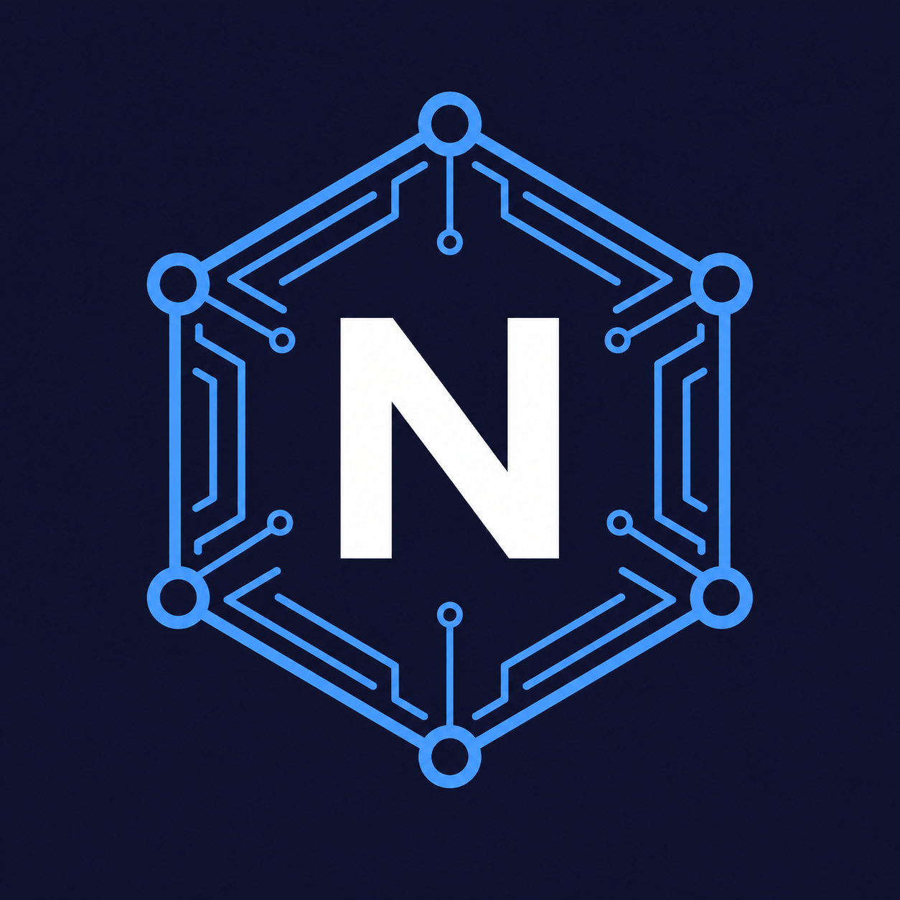
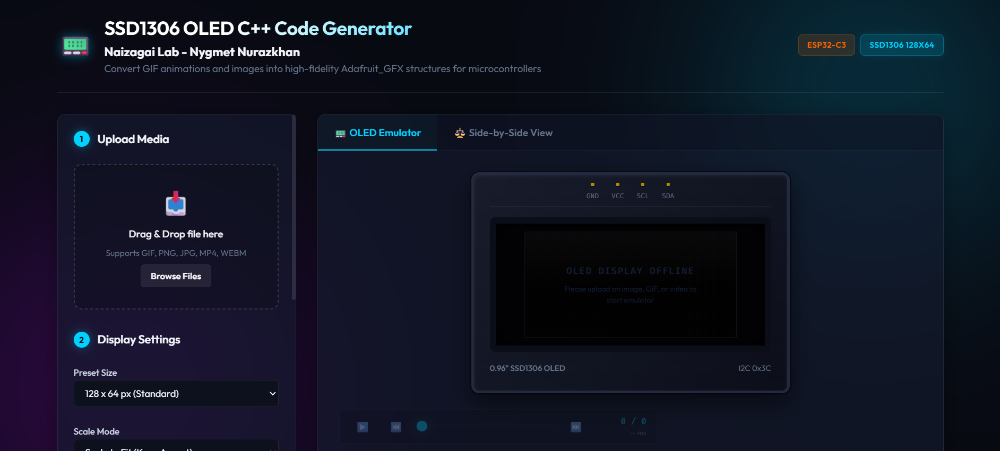
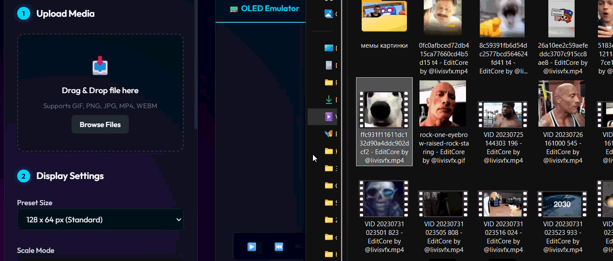
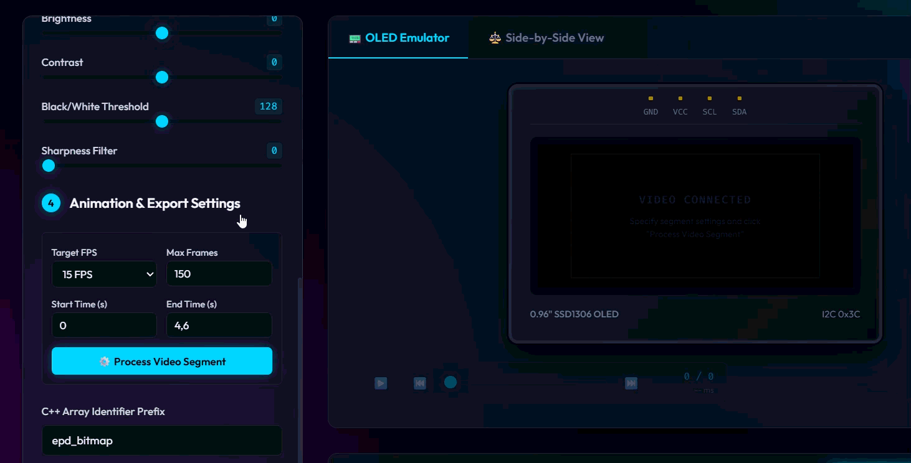
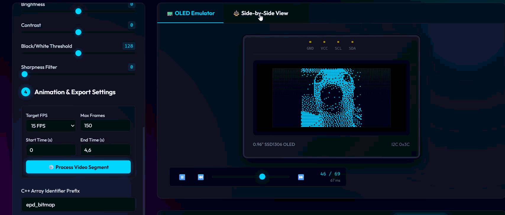

<div align="center">


# 📟 SSD1306 OLED C++ Code Generator

**Convert images, GIFs, and videos into C++ byte arrays for SSD1306 OLED displays**

*A project by [Naizagai Lab](https://naizagailab.vercel.app)*

[](#)
[](#license)
[](https://www.espressif.com/)
[](https://github.com/adafruit/Adafruit-GFX-Library)
[](#)
[](#-deploy-to-github-pages)

---



---

A **fully browser-based** tool that converts images, animated GIFs, and MP4/WebM videos into monochrome C++ header files (`.h`) ready to compile for **SSD1306 128×64 OLED** displays on **ESP32-C3** and other Arduino-compatible microcontrollers.

Everything runs **client-side in your browser** — no server needed, no uploads, no accounts.

</div>

---

## ✨ Features

| Feature | Description |
|---------|-------------|
| 🖼️ **Image Support** | PNG, JPG, WEBP — drag & drop or browse |
| 🎞️ **GIF Animation** | Full GIF compositing with disposal method support |
| 🎥 **Video Extraction** | MP4 & WebM frame-by-frame extraction with configurable FPS, start/end time |
| 🎨 **10 Dithering Algorithms** | Floyd-Steinberg, Atkinson, Bayer 4×4/8×8, Stucki, Burkes, Sierra-3/2/Lite, Threshold |
| 📐 **Scale Modes** | Fit (keep aspect), Crop (fill screen), Stretch |
| 🔆 **Image Adjustments** | Brightness, Contrast, Sharpness, Black/White Threshold sliders |
| 🔄 **Invert Colors** | Toggle black-on-white vs white-on-black output |
| 📟 **Live OLED Emulator** | Physical SSD1306 screen replica with pixel glow and CRT scanline effects |
| ▶️ **Animation Playback** | Play, pause, frame-by-frame stepping, and timeline scrubber |
| ⚖️ **Side-by-Side View** | Compare original source with processed OLED output |
| 💻 **C++ Code Generator** | `PROGMEM` byte arrays with syntax highlighting |
| 📋 **Copy & Download** | One-click copy or download as `animation_frames.h` |
| 🌐 **100% Offline** | No backend required — works entirely in the browser |

---

## 🚀 Quick Start

### Option 1 — Open directly (no install)

Just open `index.html` in your browser. That's it!

> [!NOTE]
> Some browsers block local file loading for security. If drag & drop doesn't work, use Option 2.

### Option 2 — Run with local server

Make sure you have [Node.js](https://nodejs.org/) installed (any version), then:

```bash
# Clone the repo
git clone https://github.com/YOUR_USERNAME/gifToCPP.git
cd gifToCPP

# Start the server
node server.js
```

Open **http://localhost:3000** in your browser.

> [!TIP]
> If port 3000 is busy, the server will automatically try 3001, 3002, etc.

---

## 📖 How to Use

### Step 1 — Upload Media

Drag and drop an **image**, **animated GIF**, or **MP4/WebM video** onto the upload area (or click **Browse Files**).



### Step 2 — Configure Settings

| Setting | What it does |
|---------|-------------|
| **Preset Size** | Choose `128×64` (standard), `128×32` (narrow), `64×48` (tiny), or custom |
| **Scale Mode** | How the image fits: `Fit`, `Crop`, or `Stretch` |
| **Dithering** | Algorithm for converting grayscale → monochrome pixels |
| **Brightness / Contrast** | Fine-tune the input before dithering |
| **Sharpness** | Laplacian convolution filter to enhance edges |
| **Threshold** | Cutoff point for simple black/white conversion |

### Step 3 — For Videos Only

When uploading MP4/WebM, a video configuration panel appears:

| Setting | Default | Description |
|---------|---------|-------------|
| **Target FPS** | 15 | Frame extraction rate |
| **Max Frames** | 150 | Safety limit to prevent memory overflow |
| **Start / End Time** | Auto-detected | Trim the video segment (seconds) |

Click **⚙️ Process Video Segment** to extract frames. A progress bar will show decoding status.



### Step 4 — Preview & Export

- **📟 OLED Emulator** tab shows the live rendered output on a physical SSD1306 replica
- **⚖️ Side-by-Side View** tab compares your source with the processed result
- Use **playback controls** (▶️ ⏮️ ⏭️) to step through animation frames
- Click **📋 Copy C++ Code** or **⬇️ Download .h File**



### Step 5 — Use in Arduino

Place the downloaded `animation_frames.h` file next to your `.ino` sketch:

```
your_project/
├── your_project.ino
└── animation_frames.h
```

Include it in your sketch:

```cpp
#include "animation_frames.h"
```

> [!IMPORTANT]
> The generated file includes a ready-to-use Arduino loop example at the bottom of the code output. You can copy it directly!

---

## 🎨 Dithering Algorithms Explained

<details>
<summary>Click to expand algorithm descriptions</summary>

| Algorithm | Type | Best For |
|-----------|------|----------|
| **Floyd-Steinberg** | Error Diffusion | General purpose, high quality |
| **Atkinson** | Error Diffusion | High contrast, preserves fine detail on tiny displays |
| **Bayer 4×4** | Ordered | Retro crosshatch look, stable for animations |
| **Bayer 8×8** | Ordered | Finer ordered pattern, less visual noise in animations |
| **Stucki** | Error Diffusion | Smooth gradients |
| **Burkes** | Error Diffusion | Low noise, fast |
| **Sierra-3** | Error Diffusion | High fidelity, smooth |
| **Sierra-2** | Error Diffusion | Balanced quality and speed |
| **Sierra Lite** | Error Diffusion | Fastest error diffusion |
| **Threshold** | Binary | Simple cutoff, no dithering |

> **💡 Tip for animations:** Ordered dithering (Bayer) produces stable, flicker-free frames. Error diffusion algorithms look better on static images but may cause shimmer in animations.

</details>

---

## 📁 Project Structure

```
gifToCPP/
├── index.html       # Main application page
├── styles.css       # Glassmorphic dark-theme UI styles
├── app.js           # Core engine: processing, dithering, code generation
├── server.js        # Optional zero-dependency Node.js static server
├── lib/
│   └── omggif.js    # Bundled GIF decoder (no CDN needed)
├── assets/
│   └── logo.png     # Naizagai Lab logo
├── screenshots/     # Your app screenshots for the README
└── README.md        # You are here
```

---

## 🌍 Deploy to GitHub Pages

This app is **100% static** — it works perfectly on GitHub Pages with zero configuration!

### Steps

1. **Push your code to GitHub** (if you haven't already):

   ```bash
   git add .
   git commit -m "Initial commit"
   git branch -M main
   git remote add origin https://github.com/YOUR_USERNAME/gifToCPP.git
   git push -u origin main
   ```

2. **Enable GitHub Pages**:
   - Go to your repo → **Settings** → **Pages**
   - Under **Source**, select **Deploy from a branch**
   - Under **Branch**, select `main` and `/ (root)`
   - Click **Save**

3. **Wait 1-2 minutes**, then visit:
   ```
   https://YOUR_USERNAME.github.io/gifToCPP/
   ```

> [!NOTE]
> `server.js` is only needed for local development. GitHub Pages ignores it and serves `index.html` directly as a static site.

> [!TIP]
> Google Fonts (`Outfit` and `Fira Code`) are loaded from Google's CDN, so they will work on GitHub Pages automatically. The only requirement is an internet connection for fonts — everything else is self-contained.

---

## 🖥️ Supported Boards

The generated C++ code is compatible with any board that supports the **Adafruit GFX** and **Adafruit SSD1306** libraries:

| Board | Flash Memory | Max Frames (approx) | Notes |
|-------|-------------|---------------------|-------|
| **ESP32-C3** | 4 MB | ~3,000+ frames | ✅ Recommended |
| **ESP32** | 4 MB | ~3,000+ frames | ✅ Recommended |
| **ESP8266** | 1-4 MB | ~800+ frames | ✅ Works well |
| **Arduino Mega** | 256 KB | ~200 frames | ⚠️ Limited |
| **Arduino Uno/Nano** | 32 KB | ~25 frames | ⚠️ Very limited |

> Each 128×64 monochrome frame = **1,024 bytes (1 KB)**.

---


## 🛠️ Tech Stack

- **HTML5** — Structure and semantics
- **CSS3** — Glassmorphism dark theme with animations
- **Vanilla JavaScript** — Zero framework dependencies
- **Canvas API** — Image processing, dithering, video frame capture
- **Node.js** — Optional local static server (zero dependencies)

---

## 📄 License

This project is open source under the [MIT License](LICENSE).

---

<div align="center">


**Naizagai Lab**

Made by **Nurazkhan** · 2026 · V1.0.0

_If this tool saved you time, consider giving it a ⭐!_

</div>
